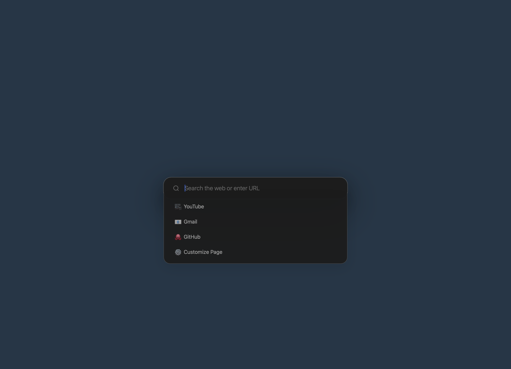
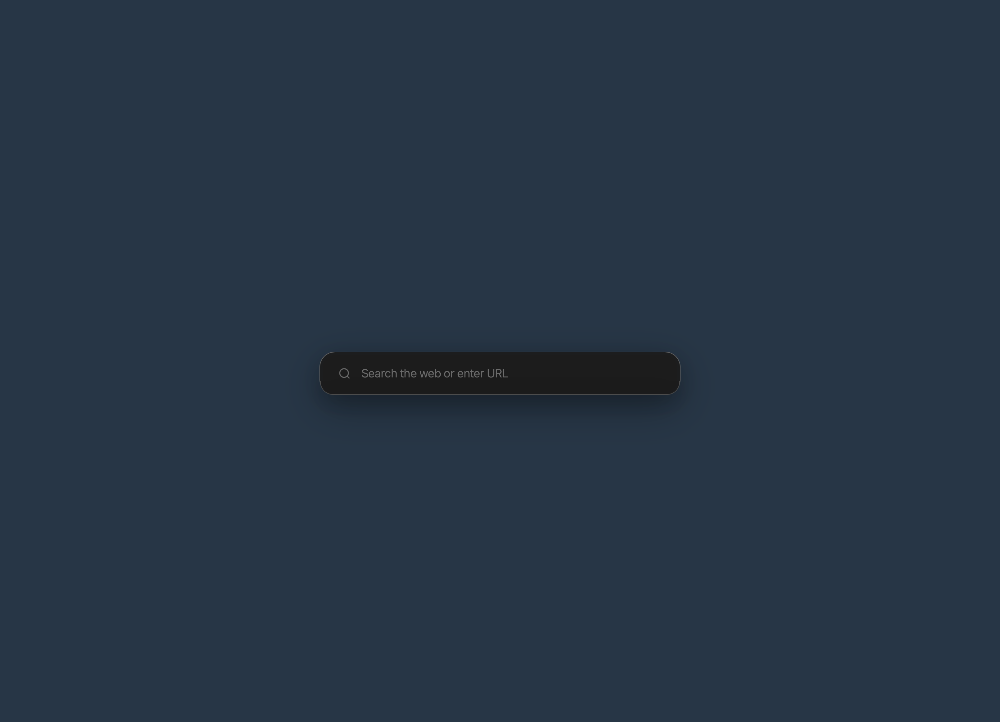
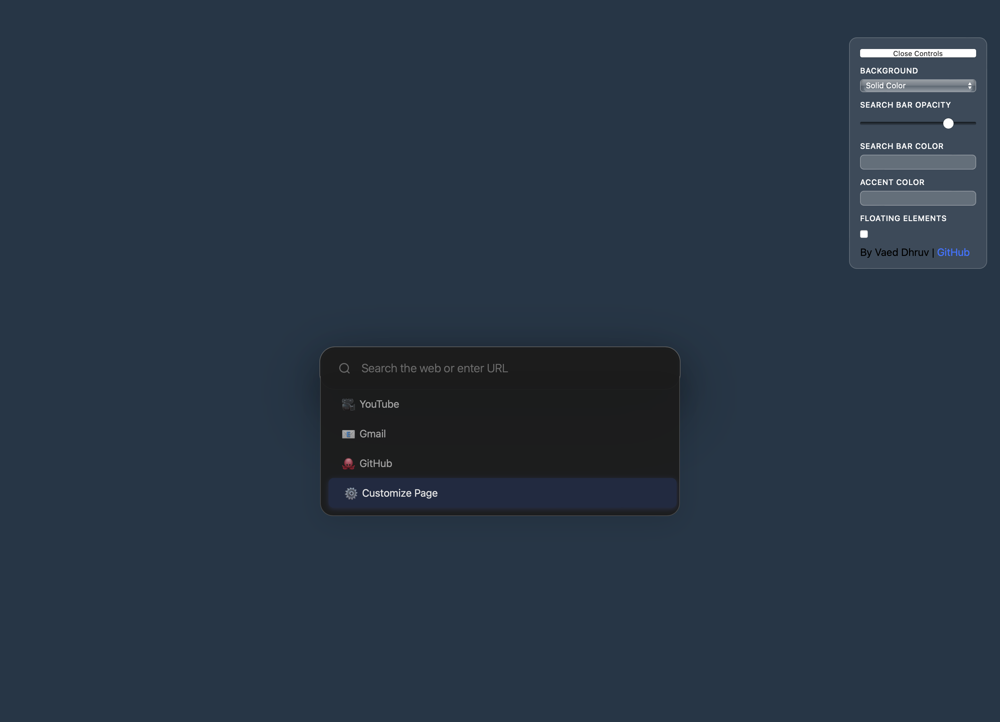

# New Tab Search
A simple and fast new tab page. Minimalistic design inspired by Arc Browser.

[Features](#features) | 
[Customization](#customization) | 
[Quick Start](#quick-start) | 
[Images](#images)

## Features
- [x] Minimalistic UI
- [x] Search Autocomplete
  - [x] With cache management
- [x] Search on Websites
- [x] Customizable UI
  - [x] Local autosave
     
## Customization
### Background
- 5 preset options
- Option to add custom colors/gradients
  - Add ``custom: <Your Hex Code>`` to the colors list
- Toggleable floating bubbles

### Search Bar
- Customizable color in on-page options
- Customizable opacity in on-page options

### Quick Links
- Edit the ``popularSuggestions`` list to add more Quick Links

### Search on Website (Advanced)
- Add new search on websites to the ``matchSuggestions`` list.
- Make sure to properly match the website's querying format

## Quick Start
### Local File (Faster)
1. Download the HTML file from this repository
2. Set your browser's new tab page to the file (``file:///path/to/file/newTabSearch.html``)

### Website (Accessible)
1. Download the HTML file from this repository
2. Deploy on any webhosting provider

## Images
### Onload (Automatically on Search Bar)

### Collapsed View (Without Open Search Bar)

### Controls Menu

